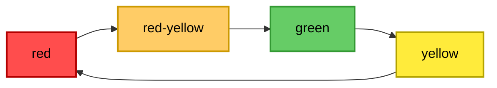
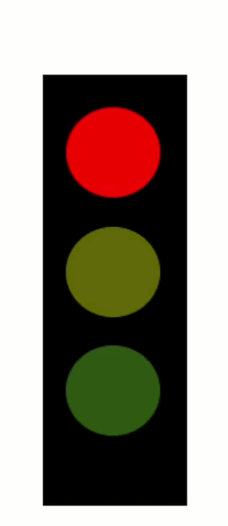

# 🚦PLC - Traffic Light 

- In this project a traffic light controller in CODESYS is implemented. 

- A state machine cycles through the different signal phases of a traffic light

- the program is written in Structured Text (ST) and uses PLC timers 

**For code access or questions, please contact me**

# Technologies used

- Development Environment - CODESYS V3

- Programming Language - Structured Text (ST)

# How it works 

- State Logic — The controller cycles through RED → RED‑YELLOW → GREEN → YELLOW → RED.

- Timer Control — Each state is active for a configurable duration using PLC timers.

- Variables — Boolean variables represent the lamp outputs (red, yellow, green).

 
 

# Result

